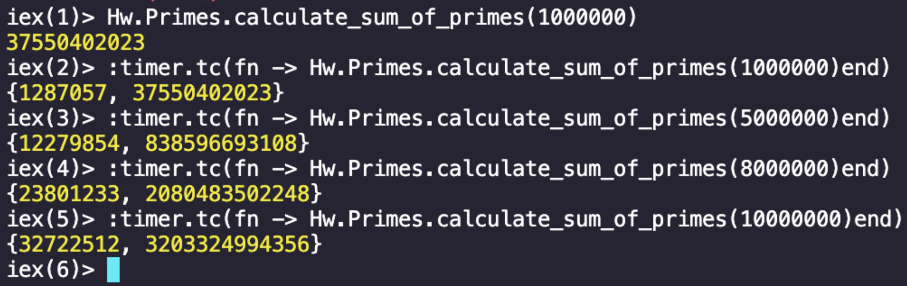
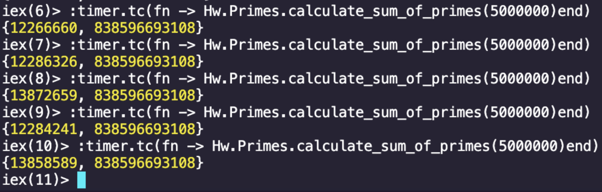
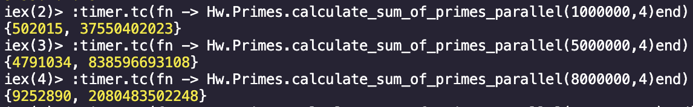
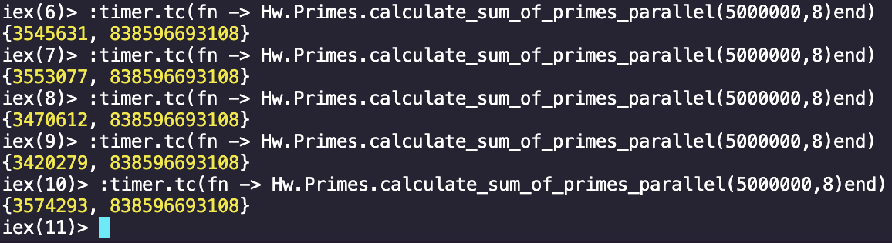

# Actividad 5.2 Programación paralela y concurrente
### Sergio Zuckermann A01
### Santiago Tena A01781293
---

Para correr la versión secuencial se requiere el siguiente comando:
    
    iex paralela.exs
    Hw.Primes.calculate_sum_of_primes(límite deseado)

Para correr la versión secuencial midiendo el tiempo de ejecución:

    iex paralela.exs
    :timer.tc(fn -> Hw.Primes.calculate_sum_of_primes(límite)end)

----

Para correr la versión paralela se requiere el siguiente comando:
    
    iex paralela.exs
    Hw.Primes.calculate_sum_of_primes_parallel(límite,threads)

Para correr la versión paralela midiendo el tiempo de ejecución:

    iex paralela.exs
    :timer.tc(fn -> Hw.Primes.calculate_sum_of_primes_parallel(límite,threads)end)

---

Cálculo del speed up: $S_p=\frac{T_1}{T_p}$

$S_8=\frac{12.266660_1}{3.545631_8}=3.45965499512$

Speedup de 3.46